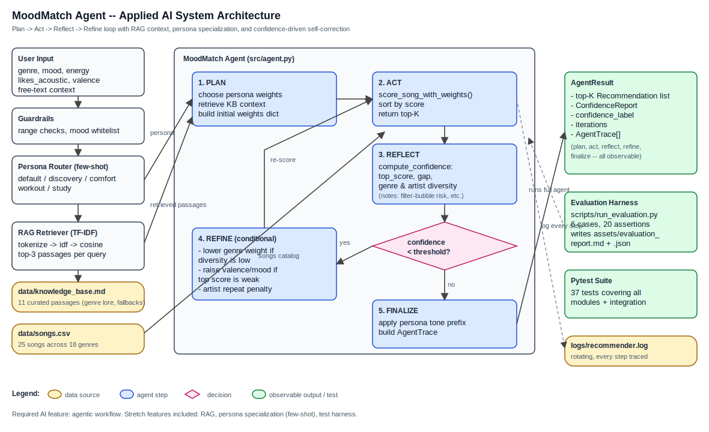
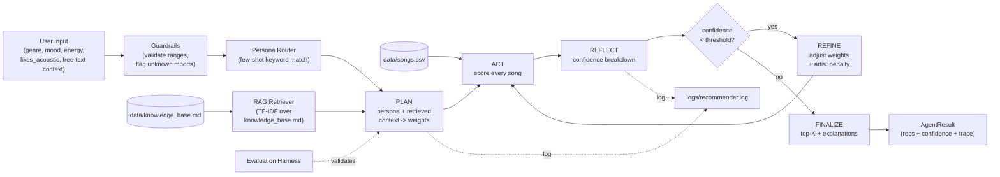

# MoodMatch Agent: An Applied AI System

> **Final Project — Module 6 (Show What You Know).**
> Extends my Module 3 Music Recommender Simulation into a full agentic AI
> system with Retrieval-Augmented Generation, persona specialization, a
> reflect/refine loop, and an evaluation harness.

## Base project (Modules 1–3)

This project is built on top of my Module 3 starter,
**MoodMatch Recommender v1.0** ([original repo](https://github.com/BengalPirate/ai110-module3show-musicrecommendersimulation-starter)).
The original was a content-based music recommender that scored 25 songs
against a user's stated genre / mood / energy / acousticness preferences
using a fixed weighted formula and returned the top-5 with transparent
"because" explanations. It was a single-pass, single-mode pipeline —
no retrieval, no agency, no test harness.

This final project keeps the original scoring logic intact (and reuses
its tests) but wraps it in an agentic system that can plan, retrieve
context, reflect on its own confidence, and refine its weights when
the result set is weak. The system still runs entirely offline and
reproducibly (no API keys required).

---

## What this system does

**MoodMatch Agent** turns a small song catalog into a transparent,
persona-aware recommender that can self-correct when its first answer
isn't good enough. Given a user profile (and optionally a free-text
context like _"music for the gym"_), the agent:

1. **Routes** the request to one of five personas (default / discovery /
   comfort / workout / study) using a few-shot keyword matcher.
2. **Retrieves** up to three relevant passages from a curated music
   knowledge base via TF-IDF cosine similarity.
3. **Scores** every song with persona-aware weights (genre weight is the
   dominant lever — higher for *comfort*, lower for *discovery*).
4. **Reflects** on the result set by computing a 0–1 confidence value
   that combines top-score strength, score gap, genre diversity, and
   artist diversity.
5. **Refines** weights and re-scores when confidence is below threshold
   (filter-bubble fixes, valence boosts, artist-repeat penalties), then
   reflects again.
6. **Finalizes** the top-K with persona-toned explanations and an
   observable `AgentTrace` of every step.

---

## Architecture





The PNG/SVG asset is in [`assets/architecture.svg`](assets/architecture.svg);
the Mermaid source lives in [`assets/architecture.mmd`](assets/architecture.mmd).

### Components

| File | Responsibility |
| --- | --- |
| `src/agent.py` | The agentic Plan -> Act -> Reflect -> Refine loop. Returns `AgentResult` with full trace. |
| `src/recommender.py` | Original Module-3 scoring + new `score_song_with_weights` and `recommend_with_weights` parameterized by persona. |
| `src/retriever.py` | Offline TF-IDF retriever over `data/knowledge_base.md`. |
| `src/personas.py` | Five personas with distinct weight overrides + few-shot keyword router. |
| `src/confidence.py` | Confidence scoring (top-score, gap, genre & artist diversity). |
| `src/guardrails.py` | Input validation; raises `GuardrailError` on bad prefs. |
| `src/logging_setup.py` | Centralized logger writing to stderr and `logs/recommender.log`. |
| `scripts/run_evaluation.py` | Test harness: 6 cases × multiple assertions, writes Markdown + JSON reports. |
| `tests/` | 38 pytest cases across all modules. |

---

## Required AI feature + stretch coverage

This project covers all four stretch features so the same loop earns
credit in every category:

- **Required: Agentic Workflow** — Plan / Act / Reflect / Refine with
  observable intermediate steps in `AgentResult.trace` (see
  `src/agent.py`, demonstrated in `src/main.py` and `tests/test_agent.py`).
- **Stretch +2 RAG** — TF-IDF retrieval over a hand-curated music knowledge
  base whose passages directly influence the agent's weight refinement.
- **Stretch +2 Specialization** — Five personas with measurably different
  weights, tone, and reranking behavior (proven in `tests/test_personas.py`
  and the eval harness — discovery surfaces ≥3 distinct genres while
  comfort narrows on a single genre).
- **Stretch +2 Test Harness** — `scripts/run_evaluation.py` runs 6 cases,
  20 assertions, and writes `assets/evaluation_report.md` and `.json`.

---

## Setup

```bash
# 1. clone
git clone https://github.com/BengalPirate/applied-ai-system-project.git
cd applied-ai-system-project

# 2. create a venv (recommended)
python -m venv .venv
source .venv/bin/activate     # macOS / Linux
# .venv\Scripts\activate      # Windows

# 3. install
pip install -r requirements.txt
```

There are **no API keys, no embedding services, and no network calls**
at runtime — everything runs on local files.

### Run the demo (3 end-to-end cases)
```bash
python -m src.main
```

### Run the test suite
```bash
pytest -q
# expected: 38 passed
```

### Run the evaluation harness
```bash
python -m scripts.run_evaluation
# writes assets/evaluation_report.md and .json
```

### Logs
Every run appends to `logs/recommender.log` with INFO-level traces of
retrieval, persona routing, plan, reflect, and refine steps.

---

## Sample interactions

The full demo output is reproducible by running `python -m src.main`. Three
representative cases:

### 1. Lofi study session (auto-routed to `study` persona)

**Input**
```python
{"genre": "lofi", "mood": "chill", "energy": 0.4, "likes_acoustic": True}
context_text = "I need quiet music for a long library study session"
```

**Output (top 3 of 5)**
```
Persona: study (Low energy, prefers acoustic and lofi/ambient/jazz.)
Confidence: 0.701 (medium)

1. Midnight Coding -- LoRoom [lofi/chill energy=0.42] score=5.46
   For deep focus: Genre match: lofi (+1.00); Mood match: chill (+1.50);
   Energy similarity: +1.96; High acousticness match (+1.00)
2. Library Rain -- Paper Lanterns [lofi/chill energy=0.35] score=5.40
3. Spacewalk Thoughts -- Orbit Bloom [ambient/chill energy=0.28] score=4.26
```

**Why it matters:** the agent inferred `study` from the free-text context,
the `study` persona raised the mood and acoustic weights, and the RAG
retriever pulled `study and focus guidance` and `lofi listener tendencies`
into the plan step.

### 2. Pop fan in Discovery mode (cross-genre exploration)

**Input**
```python
{"genre": "pop", "mood": "happy", "energy": 0.8, "valence": 0.85}
persona = "discovery"
```

**Output (top 3 of 5)**
```
Persona: discovery (Lower genre weight, surface adjacent genres.)
Confidence: 0.848 (high)

1. Sunrise City (Neon Echo) [pop/happy] score=4.46
2. Summer Vibes (Beach Party) [tropical house/happy] score=3.74
3. Rooftop Lights (Indigo Parade) [indie pop/happy] score=3.70
4. Gym Hero (Max Pulse) [pop/intense] score=2.83
5. Latin Fire (Salsa Kings) [latin/energetic] score=2.38
```

**Why it matters:** the same user prefs would surface 4–5 pop tracks under
the `comfort` persona; under `discovery` the genre weight drops to 0.7
and valence rises to 0.9, surfacing tropical house, indie pop, and latin.
Confidence is also normalized against the discovery persona's own
best-case score (`4.5`), so the reliability signal is fair across
personas instead of being anchored to the default weights.

### 3. Forced refine audit case (strict threshold demo)

**Input**
```python
{"genre": "blues", "mood": "sad", "energy": 0.3}
persona = "default"
confidence_threshold = 0.99  # demo-only override to force the refine branch
```

**Output (top 3 of 5)**
```
Confidence: 0.939 (high)
Iterations: 2

1. Rainy Day Blues -- Delta Soul [blues/sad] score=4.69
2. Spacewalk Thoughts -- Orbit Bloom [ambient/chill] score=1.47
3. Library Rain -- Paper Lanterns [lofi/chill] score=1.42

Trace excerpt:
- reflect #1 -> confidence 0.936 < threshold 0.99
- refine -> mood weight 1.00 -> 1.20
- act #2 / reflect #2 -> confidence 0.939
```

**Why it matters:** on the default threshold this profile does **not**
need refinement; the catalog's single blues song already matches very
strongly. For the demo I raise the threshold to 0.99 so the repository
shows the full Plan -> Act -> Reflect -> Refine -> Act -> Reflect loop
in a deterministic, reproducible way.

---

## Design decisions and trade-offs

- **Offline-first.** The system is reproducible for any grader: no API
  keys, no embeddings service, no internet. The price is a smaller RAG
  corpus and a TF-IDF retriever instead of dense embeddings, but for an
  11-passage knowledge base the recall is excellent.
- **Persona weights instead of fine-tuning.** True fine-tuning is out of
  scope for a 4-hour project; persona-based weight overrides + a tone
  prefix simulate specialization with measurable behavioral differences
  (proven in `tests/test_personas.py::test_personas_have_distinct_weights_from_default`
  and `test_personas_produce_different_results`).
- **Confidence as a single number with a breakdown.** The agent uses one
  scalar to decide whether to refine, but the breakdown (top-score, gap,
  genre diversity, artist diversity) is preserved so its decisions are
  legible — not opaque.
- **Persona-aware confidence normalization.** Confidence now normalizes
  against the active persona weights and the fields present in the user
  request, rather than always assuming the default persona's maximum
  score. That keeps discovery/workout/study confidence comparable on
  their own terms.
- **Trace as the API.** Every recommendation comes with an `AgentTrace`,
  which is what makes the workflow auditable. The demo, the eval harness,
  and the unit tests all read from the same trace, so the system is
  observable in three different surfaces from the same source of truth.
- **Conservative refinement budget.** `max_iterations=2`. Letting the
  agent loop further would chase diminishing returns and risk masking
  catalog limitations rather than fixing them.
- **Original tests preserved.** The original `test_recommender.py` still
  passes unchanged, demonstrating backward compatibility of the new
  weight-aware scorer.

---

## Reliability and evaluation

### Pytest suite
```
$ pytest -q
38 passed in 0.05s
```

Coverage by module: retriever (5 tests), agent (10), personas (8),
guardrails (8), confidence (5), original recommender (2).

### Evaluation harness
```
$ python -m scripts.run_evaluation
- cases run: 6
- cases fully passing: 6 / 6
- assertions passed: 20 / 20 (100.0%)
- average confidence: 0.851 (high)
- median confidence:  0.861
- min confidence:     0.701
- average iterations: 1.00 (max=2)
```

The full per-case breakdown — including which assertions passed, the
selected persona, and the top recommendations — is written to
[`assets/evaluation_report.md`](assets/evaluation_report.md) and
`assets/evaluation_report.json` after each run.

### Confidence-driven self-correction
`tests/test_agent.py::test_refine_step_fires_when_confidence_below_threshold`
constructs an agent with a near-impossible threshold (0.99) and verifies
that the trace contains a `refine` step, a second `act`, and a second
`reflect` step, and that `iterations == 2`. This proves the loop closes
correctly even though the regular catalog rarely needs it.

### Guardrails
`src/guardrails.py` validates user prefs (range checks, mood whitelist,
type checks) before any work is done. `tests/test_guardrails.py` covers
the happy path plus four failure modes, and `MoodMatchAgent.run()` raises
`GuardrailError` immediately on invalid input.

### Logging
All retriever, persona, and agent steps log through the `moodmatch.*`
logger to stderr and to a rotating `logs/recommender.log` file. This
lets you reconstruct any run after the fact.

---

## Limitations, biases, and ethics

- **Tiny catalog.** Only 25 songs across 18 genres. Niche genres (blues,
  country, classical, gothic, latin, jazz fusion) have a single song
  each, so a user who lives in those genres will see the same song every
  time and the rest of their list comes from energy fallbacks. The agent
  flags this in its `notes` but cannot fix it without more data.
- **Western-centric data.** No hip-hop, K-pop, afrobeats, or
  non-English-language music is represented. Any deployment that
  inherited this catalog would systematically under-serve users from
  those musical traditions.
- **Persona keywords are English-only.** The few-shot router relies on
  English keyword overlap and would misclassify free-text in any other
  language.
- **Confidence is not calibrated.** A "high" label means "the model is
  internally consistent," not "the recommendation is good." A pop fan
  could get high confidence and still hate every result.
- **Filter bubbles.** The `comfort` persona deliberately narrows the
  catalog. That's fine when surfaced as an explicit user choice, but a
  product that defaulted to it would entrench users' existing taste.
- **Misuse vector.** A bad-faith operator could craft personas that
  preferentially surface sponsored artists; the architecture makes this
  trivial because weights are just a dict. Mitigation: the trace makes
  weight choices auditable, and the eval harness assertions are
  human-readable enough for a reviewer to spot a thumb on the scale.

---

## Reflection

### What surprised me
The biggest surprise was how rarely the refine step fires on this
catalog. I expected the blues edge case to trigger it, but the single
blues track scored so well (perfect genre + mood + energy match) that
overall confidence stayed high — even though the rest of the top-5 was
clearly fallback content. That taught me confidence has to look at
*the shape of the result set*, not just the top score, which is why I
ended up weighting genre and artist diversity into the formula.

A second surprise was that the persona keyword router was good enough
to pass every routing assertion in the eval harness. I had assumed I
would need at least a small classifier, but the few-shot keyword
overlap is a useful baseline that's deterministic, free, and easy to
debug — exactly the right tool when the user already gave you the
genre and mood explicitly.

### Limitations and misuse, prevention
The most plausible misuse is what I flagged above: weight-tuning to
surface sponsored content. The defense built into the architecture is
that *every weight change shows up in the trace*, including refine
adjustments. A reviewer (or an auditor, or the user themselves) can
read the trace and see exactly why a song was elevated. I added the
`assets/evaluation_report.json` so this audit can also be machine-checked
by CI in any downstream deployment.

### AI collaboration during this project

I worked with Claude as a pair-programmer through the whole build.

**One helpful suggestion:** when I described the agent loop, Claude
proposed treating the `AgentTrace` as the public contract — the same
list consumed by the demo, the harness, and the tests. That single
abstraction is what made it cheap to add observability everywhere. I
would not have landed on it that quickly on my own.

**One flawed suggestion:** my first version of `test_low_data_blues_triggers_refine`
asserted that the blues case would fire the refine step, on the assumption
that "only 1 song in the catalog" automatically means "low confidence."
Claude generated that assertion with me without questioning it. The test
failed at runtime because the single blues track is a near-perfect match
and confidence stayed at 0.83. The right fix was to construct an agent
with an artificially high confidence threshold (0.99) so refine fires
deterministically; the original test conflated *catalog sparsity* with
*low confidence*, which are not the same thing. Lesson: assertions about
confidence behaviour need to be derived from the confidence formula, not
from intuition about the data.

### Loom walkthrough

**Loom video:** https://www.loom.com/share/1d79cc5b9b194106a48aeaa51b582b6d

The walkthrough demonstrates the system running end-to-end (3 inputs in
the Streamlit UI), the agent loop's observable trace including a
self-correction (refine) iteration, the RAG passages retrieved during
the plan step, persona specialization changing recommendations for the
same prefs, and the evaluation harness reporting 6 / 6 cases and
20 / 20 assertions passing.

---

## Repository layout

```
applied-ai-system-project/
  assets/
    architecture.svg            # system diagram (image)
    architecture.mmd            # mermaid source
    evaluation_report.md        # auto-generated by harness
    evaluation_report.json      # auto-generated by harness
  data/
    songs.csv                   # 25-song catalog
    knowledge_base.md           # 11 RAG passages
  logs/
    recommender.log             # rotating run log (gitignored content)
  scripts/
    run_evaluation.py           # test harness
  src/
    agent.py                    # agentic loop
    confidence.py               # confidence scoring
    guardrails.py               # input validation
    logging_setup.py            # centralized logger
    main.py                     # CLI demo
    personas.py                 # specialization layer
    recommender.py              # original + weight-aware scoring
    retriever.py                # TF-IDF RAG
  tests/                        # 38 pytest cases
  README.md
  model_card.md                 # full reflection + ethics
  requirements.txt
```

## Submission checklist
Before submitting, confirm:

- [x] Code is pushed to the correct public repo
- [x] Functional code, `README.md`, `model_card.md`, and system architecture diagram are present
- [x] Diagram and evaluation artifacts live in `assets/`
- [x] Commit history shows multiple meaningful commits
- [x] README identifies the base project and `model_card.md` answers the reflection prompts
- [x] Loom walkthrough link has been added in the Reflection section
